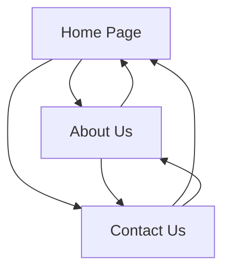

# Design Document - Ecom Global Tech Website

## Overview

The Ecom Global Tech website will be built as a modern, responsive Angular application showcasing the company's global e-commerce consulting services. The design emphasizes professionalism, trust, and global reach while maintaining simplicity and ease of navigation. The website will leverage Bootstrap 5 for responsive design and consistent styling.

## Architecture

### Technology Stack
- **Frontend Framework**: Angular 18.2.0
- **CSS Framework**: Bootstrap 5.3.7
- **Routing**: Angular Router for single-page application navigation
- **Forms**: Angular Reactive Forms for contact form handling
- **Styling**: Custom CSS combined with Bootstrap utilities
- **Icons**: Bootstrap Icons or Font Awesome for visual elements

### Application Structure
```
src/
├── app/
│   ├── components/
│   │   ├── header/
│   │   ├── footer/
│   │   ├── home/
│   │   ├── about/
│   │   └── contact/
│   ├── services/
│   │   └── contact.service.ts
│   ├── models/
│   │   └── contact.model.ts
│   └── shared/
│       └── animations/
```

## Components and Interfaces

### 1. Header Component
**Purpose**: Consistent navigation across all pages
**Features**:
- Company logo and name "Ecom Global Tech"
- Tagline "Sell globally with us..."
- Responsive navigation menu (Home, About Us, Contact Us)
- Mobile hamburger menu for smaller screens
- Active page highlighting

### 2. Footer Component
**Purpose**: Consistent footer information
**Features**:
- Company contact information
- Social media links (if applicable)
- Copyright notice
- Quick navigation links

### 3. Home Component
**Purpose**: Landing page showcasing services and value proposition
**Sections**:
- **Hero Section**: Eye-catching banner with company name, tagline, and primary CTA
- **Services Overview**: Grid layout showcasing key consulting services
- **Why Choose Us**: Benefits and value propositions
- **Client Success**: Testimonials or success metrics (placeholder content)
- **Call to Action**: Prominent contact button leading to Contact Us page

### 4. About Component
**Purpose**: Company information and team expertise
**Sections**:
- **Company Story**: Mission, vision, and founding principles
- **Our Expertise**: Areas of specialization in global e-commerce
- **Team**: Key team members and their backgrounds (placeholder content)
- **Our Approach**: Methodology and process overview
- **Achievements**: Company milestones and certifications

### 5. Contact Component
**Purpose**: Client inquiry and contact information
**Features**:
- **Contact Form**: Reactive form with validation
  - Name (required)
  - Email (required, email validation)
  - Phone (optional)
  - Company (optional)
  - Message (required)
  - Submit button with loading state
- **Contact Information**: Address, phone, email display
- **Success/Error Messages**: Form submission feedback

## Data Models

### Contact Form Model
```typescript
interface ContactForm {
  name: string;
  email: string;
  phone?: string;
  company?: string;
  message: string;
}

interface ContactSubmissionResponse {
  success: boolean;
  message: string;
}
```

## Design System

### Color Palette
- **Primary**: Deep Blue (#1e3a8a) - Trust and professionalism
- **Secondary**: Gold/Orange (#f59e0b) - Energy and global reach
- **Accent**: Light Blue (#3b82f6) - Modern and approachable
- **Neutral**: Gray scale (#f8fafc, #64748b, #1e293b)
- **Success**: Green (#10b981)
- **Error**: Red (#ef4444)

### Typography
- **Headings**: Inter or Roboto (clean, professional)
- **Body Text**: System fonts with fallbacks
- **Font Sizes**: Responsive scale using Bootstrap utilities

### Layout Principles
- **Container**: Bootstrap container for consistent max-width
- **Grid System**: Bootstrap 12-column grid for responsive layouts
- **Spacing**: Consistent padding and margins using Bootstrap spacing utilities
- **Cards**: Bootstrap cards for content sections
- **Buttons**: Custom styled Bootstrap buttons with hover effects

## User Experience Design

### Navigation Flow


### Responsive Breakpoints
- **Mobile**: < 768px (single column, hamburger menu)
- **Tablet**: 768px - 1024px (adjusted grid, collapsible elements)
- **Desktop**: > 1024px (full layout, hover effects)

### Key User Interactions
1. **Navigation**: Smooth scrolling, active states, mobile menu toggle
2. **Form Submission**: Real-time validation, loading states, success/error feedback
3. **Call-to-Actions**: Prominent buttons with hover effects
4. **Content Discovery**: Clear headings, scannable content, visual hierarchy

## Error Handling

### Form Validation
- **Client-side**: Angular validators for immediate feedback
- **Required Fields**: Visual indicators and error messages
- **Email Format**: Pattern validation with user-friendly messages
- **Submission Errors**: Network error handling with retry options

### Navigation Errors
- **404 Handling**: Redirect to home page or custom 404 component
- **Route Guards**: Ensure proper navigation flow

### Performance Considerations
- **Lazy Loading**: Route-based code splitting
- **Image Optimization**: Responsive images with proper alt tags
- **Bundle Size**: Tree shaking and minimal dependencies

## Testing Strategy

### Unit Testing
- **Component Testing**: Angular testing utilities for each component
- **Service Testing**: Contact service form submission logic
- **Form Validation**: Test all validation scenarios
- **Routing**: Navigation and route parameter testing

### Integration Testing
- **Form Submission Flow**: End-to-end contact form testing
- **Navigation Flow**: Multi-page navigation testing
- **Responsive Design**: Cross-device compatibility testing

### Accessibility Testing
- **WCAG Compliance**: Semantic HTML, proper ARIA labels
- **Keyboard Navigation**: Tab order and focus management
- **Screen Reader**: Alt tags, proper heading hierarchy
- **Color Contrast**: Ensure sufficient contrast ratios

## SEO Optimization

### Meta Tags
- **Title Tags**: Unique, descriptive titles for each page
- **Meta Descriptions**: Compelling descriptions under 160 characters
- **Open Graph**: Social media sharing optimization
- **Schema Markup**: Business and service structured data

### Content Strategy
- **Keywords**: "e-commerce consulting", "global selling", "online business"
- **Headings**: Proper H1-H6 hierarchy
- **Internal Linking**: Strategic cross-page linking
- **URL Structure**: Clean, descriptive URLs

### Performance Optimization
- **Core Web Vitals**: Optimize LCP, FID, and CLS
- **Image Optimization**: WebP format, lazy loading
- **Minification**: CSS and JavaScript optimization
- **Caching**: Browser caching strategies